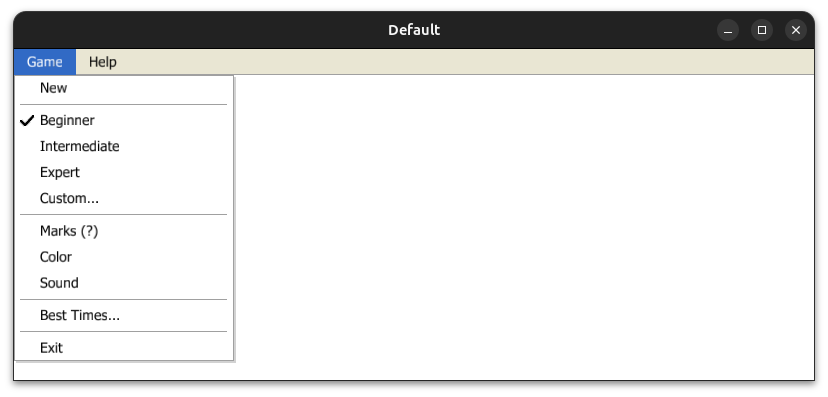
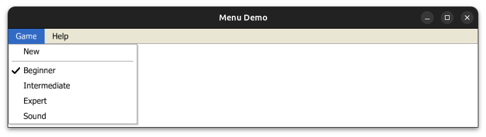
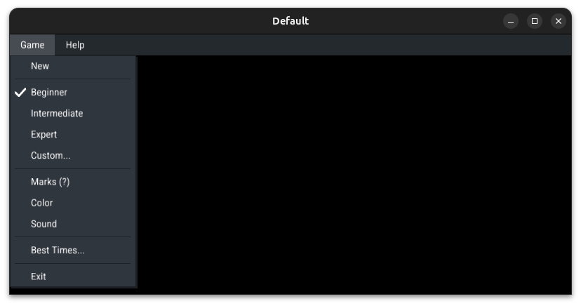
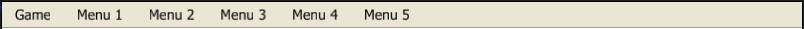
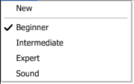

# macroquad_xp_barre_menu


[](./LICENSE)




Barre de menu **style Windows XP** pour [Macroquad](https://github.com/not-fl3/macroquad), conçue pour les jeux et outils 2D. 
S'intègre dans la boucle de rendu Macroquad (UI immediate‑mode) et propose un **style par défaut fidèle à Windows XP** (police Tahoma, couleurs XP).

---

## ✨ Fonctionnalités

- Barre horizontale avec **menus déroulants**.
- Éléments supportés :
  - **Button** (action au clic)
  - **Checkbox** (interrupteur on/off)
  - **Radio** (sélection exclusive)
  - **Separator** (séparateur visuel)
- **Style par défaut Windows XP** via `Settings::default()` (police `assets/tahoma.ttf`, couleurs XP).
- **Personnalisation complète** via `Settings` (couleurs, tailles, police).
- **Compatibilité Macroquad ≥ 0.4.14** (testé avec la version déclarée dans `Cargo.toml`).

---

## 📦 Installation

Le projet n'est pas publié sur crates.io, ajoute-le via **Git** :

```toml
[dependencies]
macroquad = "0.4.14"
macroquad_xp_barre_menu = { git = "https://github.com/bl3tt3r/macroquad-barre-menu" }
```

---

## 🚀 Démarrage rapide

```rust
use macroquad::prelude::*;
use macroquad_xp_barre_menu::*;

#[macroquad::main("Menu Demo")]
async fn main() {
    let mut barre = Barre::default()
        .with_menu(
            Menu::new("Game")
                .with_item(Button::new("New", || println!("New")))
                .with_item(Separator)
                .with_item(Radio::new(vec!["Beginner", "Intermediate", "Expert"], |v| println!("Value: {}", v)))
                .with_item(Checkbox::new("Sound", false, |v| println!("Sound: {}", v)))
        )
        .with_menu(
            Menu::new("Help")
                .with_item(Button::new("About", || println!("About")))
        );

    let settings = &Settings::default(); // Style XP par défaut

    loop {
        clear_background(WHITE);
        barre.draw(settings);
        next_frame().await;
    }
}
```



---

## 🎨 Personnalisation (Settings)

Le style par défaut (XP) utilise Tahoma et des couleurs classiques. Tu peux créer un thème personnalisé :

```rust
use macroquad::prelude::*;
use macroquad_xp_barre_menu::*;

#[macroquad::main("Custom Theme")]
async fn main() {
    let mut barre = Barre::default()
        .with_menu(Menu::new("Game").with_item(Button::new("New", || println!("New"))));

    // Exemple d'un Settings custom (type "sombre")
    let font_bytes: &[u8] = include_bytes!("style_roboto.ttf");
    let font = load_ttf_font_from_bytes(font_bytes).expect("font not found");

    let settings = Settings {
        font,
        font_size: 14,
        height: 30.0,
        width: 180.0,
        barre_background_color: Color::from_hex(0x24292e),
        barre_border_color: Color::from_hex(0x1d2125),
        item_hover_color: Color::from_hex(0x464c52),
        menu_color: Color::from_hex(0x30363d),
        text_color: WHITE,
        text_hover_color: WHITE,
        menu_shadow_color: Color::from_hex(0x1d2125),
    };

    loop {
        clear_background(BLACK);
        barre.draw(&settings);
        next_frame().await;
    }
}
```

---

## 📂 Exemples inclus

- `examples/default.rs` : style XP par défaut.
```bash
cargo run --example default
```


- `examples/start.rs` : démarrage rapide.
```bash
cargo run --example start
```


- `examples/style.rs` : personnalisation complète (ex. thème sombre).
```bash
cargo run --example style
```


---

## ✅ Compatibilité

- Macroquad **0.4.14+**
- Plateformes : **Windows, Linux, macOS, WASM, Android, iOS** (héritées de Macroquad).

---

## 🧰 Utilisation / API rapide

### Ajouter des **menus** à la barre

```rust
let mut barre = Barre::default()
    .with_menu(Menu::new("Game"))
    .with_menu(Menu::new("Menu 1"));
    .with_menu(Menu::new("Menu 2"));
    .with_menu(Menu::new("Menu 3"));
    .with_menu(Menu::new("Menu 4"));
    .with_menu(Menu::new("Menu 5"));
```



### Ajouter des **items** dans un menu

Chaîne `with_item(...)` pour empiler des items :

```rust
let menu = Menu::new("Game")
    .with_item(Button::new("New", || println!("New")))
    .with_item(Separator)
    .with_item(Radio::new(vec!["Beginner", "Intermediate", "Expert"], |v| println!("Value: {}", v)))
    .with_item(Checkbox::new("Sound", false, |enabled| println!("Sound: {}", enabled)));
```



### Dessiner la barre (dans la boucle de rendu)

```rust
let settings = &Settings::default();
loop {
    clear_background(WHITE);
    barre.draw(settings);
    next_frame().await;
}
```

---

## 🔁 Callbacks & signatures (comment Rust réagit)

### 1) `Button`
- **Constructeur** : `Button::new(label: &str, on_click: impl FnMut() + 'static)`
- **Closure** : `|| { ... }` → **aucun argument**
- **Déclenchement** : **clic gauche** sur l’item

```rust
.with_item(Button::new("Save", || {
    save_current_game();
}))
```

> Stocké en `Box<dyn FnMut()>` — tu peux capturer/modifier de l’état (via `move` + conteneurs mutables si besoin).

### 2) `Checkbox`
- **Constructeur** : `Checkbox::new(label: &str, actif: bool, on_change: impl Fn(bool) + 'static)`
- **Closure** : `|enabled: bool| { ... }` → **nouvel état** (`true/false`)
- **Déclenchement** : à **chaque bascule**

```rust
.with_item(Checkbox::new("Sound", false, |enabled| {
    if enabled { enable_sound(); } else { disable_sound(); }
}))
```

> Stocké en `Box<dyn Fn(bool)>` — closure non mut. Pour changer un état externe, utilise `Rc<RefCell<_>>` ou applique ta logique ailleurs.

### 3) `Radio`
- **Constructeur** : `Radio::new(options: Vec<&str>, on_change: impl Fn(&str) + 'static)`
- **Closure** : `|value: &str| { ... }` → **option choisie** (ex. `"Expert"`)
- **Déclenchement** : lorsqu’une **option** est sélectionnée

```rust
.with_item(Radio::new(vec!["Beginner", "Intermediate", "Expert"], |value| {
    match value {
        "Beginner" => set_difficulty(Difficulty::Beginner),
        "Intermediate" => set_difficulty(Difficulty::Intermediate),
        "Expert" => set_difficulty(Difficulty::Expert),
        _ => {}
    }
}))
```

> Par défaut, la **première option** du vecteur est active.

### 4) `Separator`
- **Constructeur** : `Separator`
- **Rôle** : séparation visuelle, **pas de callback**

---

## 🧪 Mini‑recettes

### Sous‑menu "Options" avec `Checkbox` + `Radio`
```rust
.with_menu(
    Menu::new("Options")
        .with_item(Checkbox::new("Fullscreen", false, |v| apply_fullscreen(v)))
        .with_item(Separator)
        .with_item(Radio::new(vec!["Low", "Medium", "High"], |quality| {
            set_quality(quality);
        }))
)
```

### Bouton qui sauvegarde et ferme le menu
```rust
.with_item(Button::new("Save", || {
    save_current_game();
    // la fermeture du menu actif est gérée en interne par la lib
}))
```

---

## 📜 Licence

Ce projet est distribué sous **Apache License 2.0**. Vous pouvez utiliser, modifier, distribuer et vendre le logiciel, sous réserve d’indiquer les changements, conserver les avis d’attribution et respecter la licence.
Aucune garantie ni obligation de support n’est fournie.
Voir le fichier [`LICENSE`](./LICENSE) pour le texte complet.
